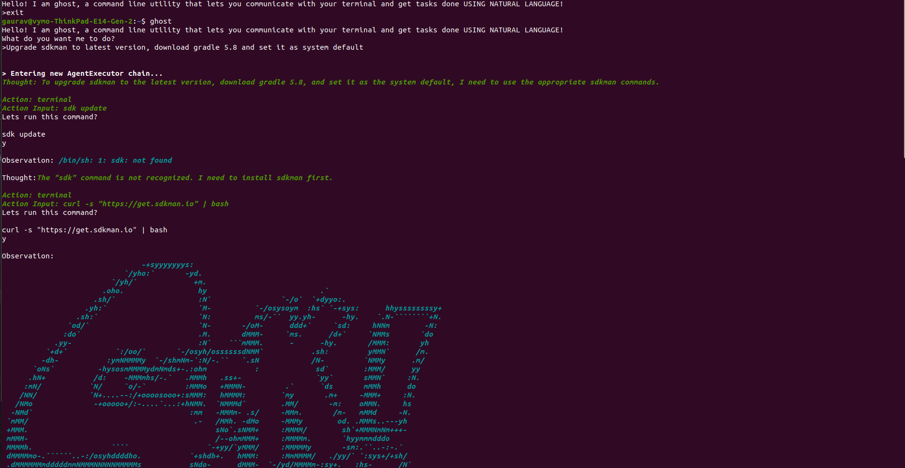

# Ghost in the shell

**ghost** is a utlity that allows you to communicate with your terminal in natural language! Tell ghost what you need to get done, it'll try to figure out the necessary commands on its own and get your job done! 

Created by [Gaurav](https://www.github.com/guilefoylegaurav) and [Sougata](https://github.com/sougata-fincent), this is our submission for [Replit's GenAI Hackathon](https://peerlist.io/hackathon)

# Safety Concerns

Ghost has default safe mode (asks for approval before executing command). If you feel comfortable giving Ghost the freedom to execute commands on its own, do so at your own risk.

# Prerequisites

 - System using Ubuntu/MacOS
 - Python3
 - Open AI API key
 
 # Installation
 
 Run this

    curl -L -O https://github.com/guilefoylegaurav/ghost/archive/refs/heads/main.zip && unzip main.zip && cd ghost-main && chmod +x script.sh && ./script.sh <OPEN_AI_API_KEY>

Then try invoking ghost in your terminal 

    $ ghost 
    Hello! I am ghost, a command line utility that lets you communicate with your terminal and get tasks done USING NATURAL LANGUAGE!
    What do you want me to do?
    >

ghost has default safe mode (asks for approval before executing command) 

 # Screenshots

 
